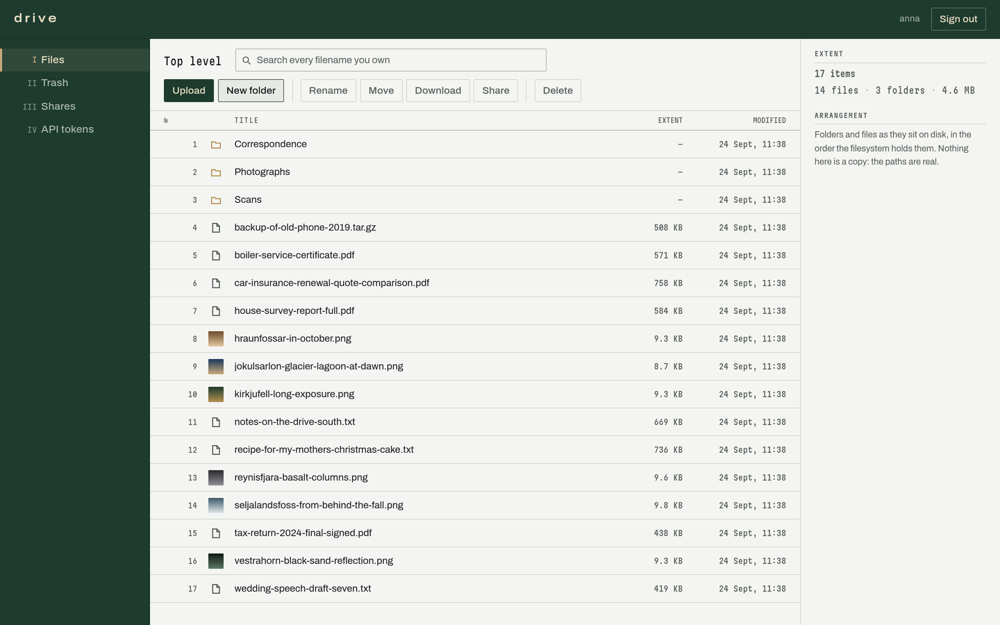
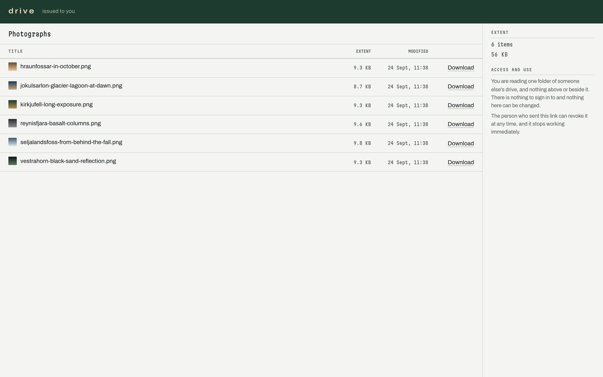
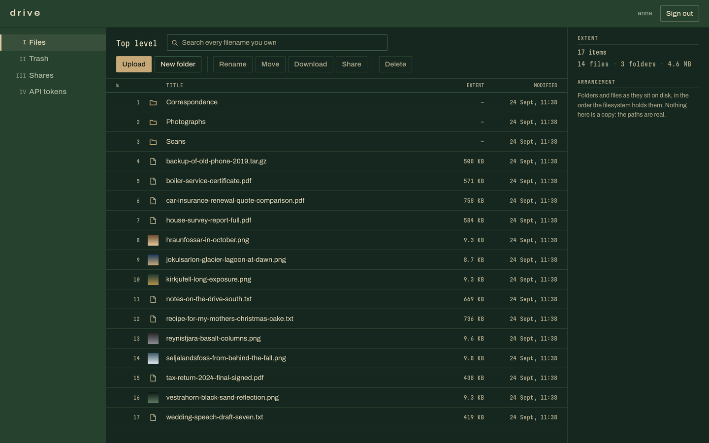

<h1 align="center">drive</h1>

<p align="center">
  Your own drive, in one binary. Browse, upload, share, and search your files from a browser —
  with no configuration, no database server, and no lock-in.
</p>

<p align="center">
  
</p>

## Why this one

- **One file to run.** Download the binary, run it, open the URL it prints. That is the install.
- **Your files stay files.** They live at `users/<name>/` at the paths you gave them. Open them over
  SSH, back them up with `rsync`, edit them from another program — the drive notices and catches up.
- **Nothing is stored in a private format.** The SQLite index is a disposable cache of what is on
  disk. Delete it and it rebuilds.
- **Only "delete forever" destroys anything.** Overwrites and deletes go through trash first.
- **HTTPS by typing your domain name.** One variable, a real Let's Encrypt certificate, auto-renewed.

## Get started

Grab the binary for your architecture from the [latest
release](https://github.com/fosslife/drive/releases/latest) — `drive-linux-amd64` or
`drive-linux-arm64`, checksums in `SHA256SUMS` — make it executable, and run it:

```sh
chmod +x drive-linux-amd64 && mv drive-linux-amd64 drive
./drive
```

That is the whole setup. It picks a data directory, creates it, starts on `:8080`, and prints a
one-time URL for creating your account:

```
WARN  serving plaintext HTTP on an address other than localhost: anyone on this network can
      read passwords, files, and session cookies address=[::]:8080
      fix="put it behind a proxy that terminates TLS, or set DRIVE_HOSTNAME to a public name"
INFO  drive started version=v0.1.0 address=[::]:8080 encrypted=false data_dir=/home/you/.local/share/drive
WARN  no account exists yet: open this URL to create the first administrator
      url="http://localhost:8080/setup?token=cQgFFHLQk87H96Np97C09UqaloejjZMkEXYVFPl3tsg"
```

Open it, pick a username and password, and you are in. The token works once, survives restarts
until you use it, and the setup page stops existing the moment the first administrator exists.

> **About that warning.** The default listener accepts from the whole network in plaintext. Turn on
> HTTPS below, or for a quick local try-out silence it with `DRIVE_ADDR=127.0.0.1:8080`.

### Turn on HTTPS

Name the drive and it gets a real certificate from Let's Encrypt and renews it:

```sh
DRIVE_HOSTNAME=drive.example.com DRIVE_ACME_EMAIL=you@example.com ./drive
```

The name must already point at the machine, and the CA must be able to reach it from the internet
on port 80 or 443 to check that you own it. The listen address becomes `:443` on its own, and the
certificate is obtained *before* the port opens — a drive that cannot get one fails at startup with
the reason instead of serving broken handshakes.

Leave `DRIVE_HOSTNAME` unset and it serves plaintext and generates no certificate of any kind. It
will never sign one for itself: a browser warning on first run is not security. Plaintext is the
right answer behind a proxy that terminates TLS, on a Tailscale address, or on loopback.

### Or run it in a container

```sh
podman compose up -d             # docker compose works too, the file is the same
podman compose up -d --build     # after changing any source
```

One service, one volume, one port. The image contains the same static binary and nothing else — no
runtime, no database server, no web server.

<details>
<summary>Why <code>--build</code>, and why the file is named <code>Dockerfile</code></summary>

`up` starts the image it already has and only builds when there is none, so after changing any
source, pass `--build` or the container will faithfully serve the previous version. `down -v` will
not help — it deletes your data volume and leaves the stale image untouched.

The build file is called `Dockerfile` rather than `Containerfile` because that is the name every
tool agrees on: Compose only ever looks for `Dockerfile`, while `podman build` accepts it as a
fallback. The podman-native name works with `podman build` and breaks `podman compose`.

</details>

## Sharing

Select a folder, press **Share**, send the link. Whoever opens it gets that one folder and nothing
above or beside it — no account, no sign-in, read-only. Revoke it and it stops working immediately.

<p align="center">
  
</p>

## Configuration

There is no config file and there will never be one. Every value has a working default; the
environment overrides it.

| Variable | Default | What it does |
|---|---|---|
| `DRIVE_DATA_DIR` | `$XDG_DATA_HOME/drive`, else `~/.local/share/drive`, else `/var/lib/drive` | Everything that survives a restart |
| `DRIVE_ADDR` | `:8080`, or `:443` with a hostname set | Listen address |
| `DRIVE_HOSTNAME` | unset | Public DNS name. Setting it is the only switch for HTTPS |
| `DRIVE_ACME_EMAIL` | unset | Where the CA sends expiry warnings |
| `DRIVE_ACME_DIRECTORY` | Let's Encrypt | Point at a staging or private CA |
| `DRIVE_MIN_FREE_BYTES` | `1073741824` (1 GiB) | Headroom kept free; writes are refused below it |
| `DRIVE_SCAN_INTERVAL` | `15m` | How often the index catches up with the disk |
| `DRIVE_UPLOAD_RETENTION` | `24h` | How long an interrupted upload waits to be resumed |
| `DRIVE_TRASH_RETENTION` | `720h` (30 days) | How long deleted files stay recoverable. `0` means forever |

## Backups

**Back up the whole data directory**, not just `users/`.

```
index.db                  file metadata, rebuildable by scanning — and accounts, which are not
certs/acme/               certificates, only when DRIVE_HOSTNAME is set
users/<username>/         your files, at their real paths
  .drive/{tmp,trash,thumbs}
```

File metadata is rebuildable by scanning, but **accounts, API tokens, and share links live only in
`index.db`** and are gone with it. That is a deliberate trade: losing the index can never cost you a
byte of file content, and re-creating an account with its original username reattaches it to its
files.

```sh
scripts/backup.sh backup <data-dir> <backup-dir>
```

That does it consistently while the drive is running, including the SQLite online backup. The full
procedure, and how to restore from files alone, is in [docs/backup.md](docs/backup.md).

## Behind a reverse proxy

Uploads are resumable and chunked, which trips the default body-size limit on some proxies — nginx
refuses at 1 MiB out of the box. Caddy needs nothing. See [docs/proxies.md](docs/proxies.md).

## It follows your system theme

<p align="center">
  
</p>

---

<details>
<summary><strong>Developing</strong></summary>

Nothing here needs rebuilding an image to see a change, and there is no separate dev compose file
because there is nothing for it to do. The interface is an ordinary client of the API, in
development exactly as in production, so the two halves are worked on independently.

**Changing the interface.** Leave the container running and put Vite in front of it:

```sh
podman compose up -d                 # the API, on :8080
npm --prefix web run dev             # the interface, on :5173, with hot reload
```

Open <http://localhost:5173>. Vite serves the app from source and proxies `/api` to whatever is
listening on `:8080` — the container, or a binary you ran yourself, it does not care. Edits appear
immediately; no image build, no restart, no `dist/`.

**Changing the Go side.** This is the part a Next.js habit expects to be hard, and it is not:

```sh
go run ./cmd/drive                   # a second or two, then it is serving
```

Stop it, run it again. A watcher would save you the keystroke and cost a dependency; the compile is
already faster than a container restart. Run it on `:8080` and the Vite proxy above finds it with no
configuration. Rebuild the image only to ship one — that is what `--build` is for.

</details>

<details>
<summary><strong>Building from source</strong></summary>

Go lives wherever you put it; there is no cgo and no C toolchain.

```sh
npm --prefix web ci && npm --prefix web run build   # the interface, embedded by web/embed.go
go build -ldflags "-X main.Version=v0.1.0" -o drive ./cmd/drive
```

`go build` does not build the interface — it is a separate step, and a binary missing it serves the
whole API and answers `/` with a note saying so. `scripts/release.sh` does both and cross-compiles
for linux amd64 and arm64.

The screenshots above are captured from the real binary in a real browser:

```sh
node web/e2e/shots.mjs docs/screenshots 1440
```

</details>

<details>
<summary><strong>Design notes</strong></summary>

- Nothing but permanent delete destroys your bytes. Overwrites and deletes go to trash first.
- Writes are atomic: temp file, fsync, rename, fsync the parent directory. An interrupted upload
  cannot be observed as a half-written file.
- The reconciler has no delete path. A file that vanishes from disk is marked missing, never purged.
- Stored files are served as attachments with `nosniff` and a restrictive CSP. Inline rendering is
  limited to inert raster images — never SVG, never PDF.
- Accounts are isolated: one storage root each, no shared folders, no groups. See
  [BACKLOG.md](BACKLOG.md) for what was deliberately left out and why.

</details>
